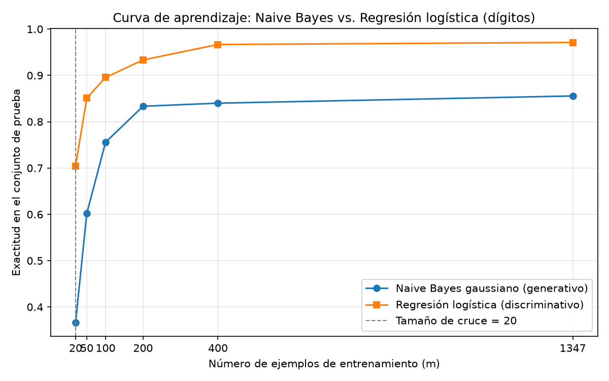

# ¿Gana el generativo con pocos datos? Ng y Jordan sobre dígitos manuscritos

## Introducción

Ng y Jordan (2001) comparan pares generativo–discriminativo y sostienen que, aunque el clasificador discriminativo (regresión logística, LR) tiene menor error asintótico, el generativo (Naive Bayes, NB) se acerca a su propio error asintótico —más alto— con muchos menos ejemplos. De ahí predicen dos regímenes de desempeño según el tamaño del entrenamiento: con pocos datos ganaría NB y, a partir de un punto de cruce, ganaría LR. Esta tarea pone a prueba esa predicción sobre dígitos manuscritos (`load_digits` de scikit-learn), usando una única partición entrenamiento/prueba y evaluando siempre sobre el mismo conjunto de prueba, que nunca se emplea para ajustar ni elegir nada.

## Metodología

**Datos y partición (T1).** El conjunto tiene 1797 ejemplos, 64 atributos (píxeles 8×8) y 10 clases (dígitos 0–9). Se dividió 75 %/25 % estratificando por la clase con `random_state=7`: 1347 ejemplos de entrenamiento y 450 de prueba. La partición es única en toda la tarea. Las clases quedaron balanceadas; en prueba cada dígito tiene entre 43 y 46 ejemplos.

**Modelos (T2).** `GaussianNB` con valores por defecto sobre los atributos originales, sin escalar, y `LogisticRegression(max_iter=3000)` sobre atributos estandarizados con `StandardScaler` ajustado solo con el conjunto de entrenamiento. Métricas: exactitud (accuracy) y F1 macro sobre prueba.

**Curva de aprendizaje (T3).** Con la misma partición, se entrenaron ambos modelos con m = 20, 50, 100, 200 y 400 ejemplos y con el entrenamiento completo (1347). Cada submuestra se obtuvo con `train_test_split(X_train, y_train, train_size=m, stratify=y_train, random_state=7)`. El escalador se ajustó únicamente con los m ejemplos de cada corrida. La evaluación fue siempre sobre el mismo conjunto de prueba y la figura se guardó como PNG.

## Resultados

**Parte 2 — desempeño sobre el conjunto de prueba (450 ejemplos):**

| Modelo | Accuracy | F1 macro |
|---|---|---|
| GaussianNB (atributos sin escalar) | 0.8556 | 0.8552 |
| LogisticRegression (atributos estandarizados) | 0.9711 | 0.9711 |

**Parte 3 — curva de aprendizaje (accuracy sobre prueba):**

| m | GNB | LR | LR − GNB |
|---|---|---|---|
| 20 | 0.3667 | 0.7044 | 0.3378 |
| 50 | 0.6022 | 0.8511 | 0.2489 |
| 100 | 0.7556 | 0.8956 | 0.1400 |
| 200 | 0.8333 | 0.9333 | 0.1000 |
| 400 | 0.8400 | 0.9667 | 0.1267 |
| 1347 | 0.8556 | 0.9711 | 0.1156 |

## Discusión

**No se observa el cruce predicho.** LR supera a GNB desde el tamaño más pequeño probado (m=20: 0.7044 contra 0.3667) y mantiene la ventaja en todos los tamaños. El primer régimen de Ng y Jordan —generativo mejor con pocos datos— no aparece en estos datos con esta pareja de modelos.

**Sí hay evidencia parcial de convergencia más rápida del generativo.** La curva de GNB se aplana pronto: pasa de 0.8333 (m=200) a 0.8400 (m=400) y 0.8556 (m=1347), de modo que a partir de m=200 los incrementos son mínimos. LR en cambio sigue mejorando (0.9333 → 0.9667 → 0.9711). La brecha cae de 0.3378 a un rango de 0.1000–0.1267, coherente con que NB se acerca rápido a su asíntota; el problema es que esa asíntota queda muy por debajo de la de LR.

**Qué supuesto falla.** Si el cruce no se observa, la explicación más plausible es el supuesto de independencia condicional entre atributos dado el dígito. En imágenes de dígitos los píxeles vecinos están fuertemente correlacionados: los trazos cubren regiones contiguas, de modo que modelar p(x|y) como producto de gaussianas por píxel ignora esa estructura y degrada el error asintótico del generativo tanto que ni siquiera con 20 ejemplos logra superar a LR. En términos de Ng y Jordan, la separación entre ambos errores asintóticos es aquí demasiado grande para que la ventaja de convergencia de NB produzca un cruce dentro del rango probado.

**Recomendación práctica.** Con estos datos conviene LR desde m=20 en adelante; GNB solo sirve como línea base muy barata. Un eventual cruce quedaría por debajo de 20 ejemplos, fuera del rango evaluado.

## Conclusiones

- Sobre dígitos (1797 ejemplos, 64 atributos, 10 clases) con partición única 75/25 (`random_state=7`), LR alcanzó 0.9711 de accuracy y 0.9711 de F1 macro, frente a 0.8556 y 0.8552 de GNB.
- El cruce generativo→discriminativo predicho por Ng y Jordan no se observó: LR ganó desde m=20. La curva sí muestra al generativo convergiendo antes (se aplana a partir de m=200), pero hacia un error asintótico claramente peor.
- La violación de la independencia condicional entre píxeles vecinos —evidente en imágenes— explica la asíntota pobre de GaussianNB y la ausencia del cruce.
- Lección: la predicción teórica supone que el modelo generativo es razonable para los datos; cuando su supuesto estructural falla, el discriminativo domina en todo el rango de tamaños de entrenamiento.