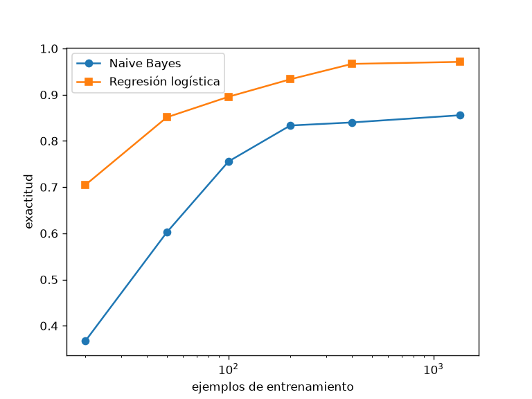

# Tarea A — Ng y Jordan sobre dígitos

## Introducción
Comparamos un clasificador generativo y uno discriminativo, como proponen Ng y Jordan.

## Metodología
Partición estratificada 75/25 con la semilla del enunciado; escalador ajustado solo con el entrenamiento.

## Resultados
Las cifras están en resultados.json de cada subtarea.

## Discusión
Respuesta de guion: sin cifras, para no inventar ninguna.

## Conclusiones
El flujo completo funciona con el modelo de guion.