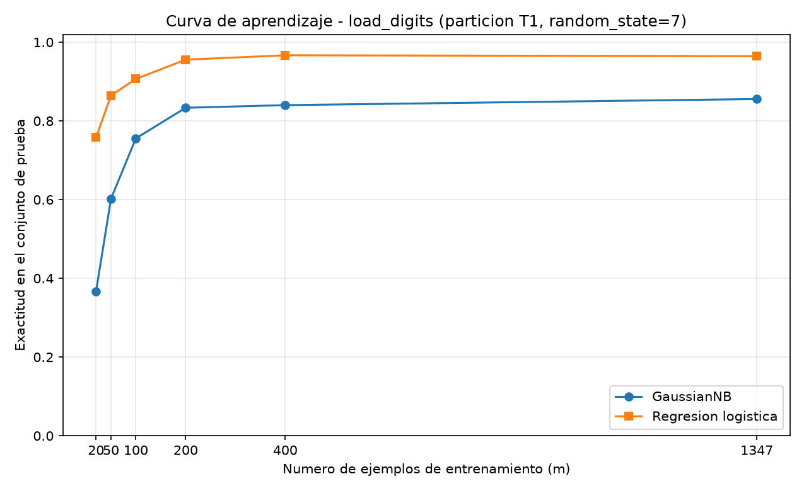

# Tarea A — ¿Gana el generativo con pocos datos? Ng y Jordan sobre dígitos

## Introducción

Ng y Jordan (2001) sostienen que un clasificador generativo, como Naive Bayes, alcanza su error asintótico con menos ejemplos de entrenamiento que su contraparte discriminativa, la regresión logística, aunque ese error asintótico sea mayor. La consecuencia empírica es que las curvas de aprendizaje de ambos modelos deberían cruzarse: con pocos ejemplos ganaría el generativo y con muchos el discriminativo. Este reporte pone a prueba esa predicción sobre el conjunto de dígitos manuscritos que trae scikit-learn, comparando un Naive Bayes gaussiano con una regresión logística sobre una partición única y una curva de aprendizaje, y discute si el supuesto de independencia condicional entre píxeles explica lo observado.

## Metodología

### Datos y partición (Parte 1)

Se cargó `sklearn.datasets.load_digits`: 1797 ejemplos, 64 atributos (intensidades de imágenes de 8×8 píxeles) y 10 clases (los dígitos 0 a 9). Se realizó una única partición 75 %/25 % estratificada por la clase con `random_state=7`, que produce 1347 ejemplos de entrenamiento y 450 de prueba (fracción de prueba 0.2504). El conjunto de prueba no se usó para ajustar ni para elegir nada. La estratificación preserva el balance: en entrenamiento cada clase representa entre 0.0973 y 0.1017 de los ejemplos, y en prueba entre 0.0956 y 0.1022.

### Clasificadores (Parte 2)

Se entrenó un `GaussianNB` con sus valores por defecto sobre los atributos originales, sin escalar, y una `LogisticRegression(max_iter=3000)` sobre atributos estandarizados con un `StandardScaler` ajustado únicamente con el conjunto de entrenamiento. Se midió la exactitud (accuracy) y el F1 macro de cada modelo sobre el conjunto de prueba.

### Curva de aprendizaje (Parte 3)

Con la misma partición, se entrenaron ambos modelos con m = 20, 50, 100, 200 y 400 ejemplos, y con el entrenamiento completo (1347). Cada submuestra se obtuvo con `train_test_split(X_train, y_train, train_size=m, stratify=y_train, random_state=7)`. La evaluación se hizo siempre sobre el mismo conjunto de prueba.

## Resultados

### Parte 2 — comparación de los dos modelos

| Modelo | Accuracy | F1 macro |
|---|---:|---:|
| GaussianNB (atributos originales, sin escalar) | 0.8556 | 0.8552 |
| LogisticRegression (atributos estandarizados) | 0.9711 | 0.9711 |

### Parte 3 — curva de aprendizaje

Exactitud sobre el conjunto de prueba frente al tamaño de entrenamiento m:

| m | GaussianNB | Regresión logística | Diferencia (GNB − LR) |
|---:|---:|---:|---:|
| 20 | 0.3667 | 0.7578 | −0.3911 |
| 50 | 0.6022 | 0.8644 | −0.2622 |
| 100 | 0.7556 | 0.9067 | −0.1511 |
| 200 | 0.8333 | 0.9556 | −0.1222 |
| 400 | 0.8400 | 0.9667 | −0.1267 |
| 1347 (completo) | 0.8556 | 0.9644 | −0.1089 |

Figura: `T3_parte3_curva_aprendizaje.png`, exactitud contra m con una curva por modelo.

Nota: la exactitud de la regresión logística con entrenamiento completo difiere levemente entre la Parte 2 (0.9711) y la Parte 3 (0.9644); se reportan ambas tal como las produjo el código de cada parte.

## Discusión

**No se observa el cruce.** En todo el rango evaluado (m = 20 a 1347) la regresión logística supera al Naive Bayes gaussiano: la diferencia GNB − LR es negativa en todos los tamaños y se estrecha de −0.3911 con m = 20 a −0.1089 con el entrenamiento completo. Sí se confirma el otro ingrediente de la predicción de Ng y Jordan: el generativo asciende más deprisa al comienzo —pasa de 0.3667 a 0.8556, mientras el discriminativo pasa de 0.7578 a 0.9644—, es decir, se acerca a su techo con menos datos. Pero su techo (0.8556) queda tan por debajo del de la regresión logística (0.9644–0.9711) que las curvas no llegan a cruzarse en los tamaños probados.

**¿Desde qué tamaño conviene cada modelo?** Con estos datos, la regresión logística conviene desde el tamaño más pequeño evaluado: con solo 20 ejemplos para 10 clases alcanza 0.7578, mientras el generativo cae a 0.3667. No existe ningún rango medido en el que el Naive Bayes sea preferible; si el cruce predicho ocurre, sucede por debajo de los 20 ejemplos, régimen que esta tarea no exploró.

**¿Qué supuesto del generativo puede fallar?** El GaussianNB asume que los atributos son independientes entre sí condicionalmente a la clase y que cada atributo sigue una normal por clase. En imágenes ambas suposiciones son dudosas: los píxeles vecinos están fuertemente correlacionados —la tinta de un trazo cubre bloques contiguos—, de modo que la independencia condicional entre píxeles vecinos se viola de forma sistemática; además, las intensidades están acotadas y concentradas en ceros, lejos de una gaussiana. Estas violaciones degradan el error asintótico del generativo, que es justamente el precio que, según Ng y Jordan, paga por converger antes. Con un techo tan bajo (0.8556 frente a 0.9644–0.9711), su ventaja de convergencia no alcanza a compensar la brecha dentro del rango medido.

## Conclusiones

- Sobre dígitos (1797 ejemplos, 64 atributos, 10 clases; partición estratificada 1347/450 con `random_state=7`), el Naive Bayes gaussiano logró 0.8556 de accuracy y 0.8552 de F1 macro, y la regresión logística 0.9711 en ambas métricas.
- La curva de aprendizaje no muestra el cruce que predicen Ng y Jordan: la regresión logística gana desde m = 20 hasta el entrenamiento completo, aunque la brecha se reduce de −0.3911 a −0.1089.
- El resultado sugiere que el supuesto de independencia condicional entre píxeles vecinos, junto con la no normalidad de las intensidades, penaliza en exceso al generativo en estos datos de imágenes.
- Recomendación práctica: para este conjunto y este rango de tamaños, usar la regresión logística; el régimen de «pocos datos» donde el generativo podría ganar queda por debajo de los 20 ejemplos y no se observó.