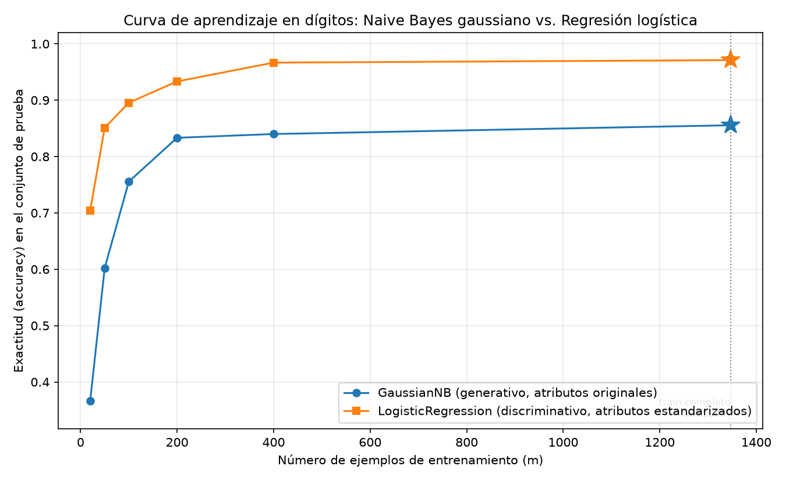

# Tarea A — ¿Gana el generativo con pocos datos? Ng y Jordan sobre dígitos

## Introducción

Ng y Jordan (2001) predicen para un par generativo-discriminativo dos regímenes de rendimiento: el modelo generativo (Naive Bayes) se acerca a su error asintótico con muchos menos ejemplos que el discriminativo (regresión logística), aunque su error asintótico sea mayor. En consecuencia, con pocos datos debería ganar el generativo y con muchos el discriminativo, con un cruce intermedio. Esta tarea contrasta esa predicción sobre dígitos manuscritos (`sklearn.datasets.load_digits`), comparando GaussianNB con LogisticRegression bajo una única partición entrenamiento/prueba.

## Metodología

**Datos y partición (T1).** El conjunto tiene 1797 ejemplos, 64 atributos (píxeles de 8×8) y 10 clases (dígitos 0–9). Se dividió 75 %/25 % con estratificación por clase y `random_state=7`, obteniendo 1347 ejemplos de entrenamiento y 450 de prueba (1347 + 450 = 1797). Esta partición es la única de toda la tarea: el conjunto de prueba no se usó para ajustar ni para elegir nada.

**Clasificadores (T2).** GaussianNB con sus valores por defecto sobre los atributos originales, sin escalar; LogisticRegression(max_iter=3000) sobre atributos estandarizados con un StandardScaler ajustado solo con el conjunto de entrenamiento. Se reporta accuracy y F1 macro sobre el test.

**Curva de aprendizaje (T3).** Con la misma partición, se entrenaron ambos modelos con m = 20, 50, 100, 200 y 400 ejemplos (submuestras estratificadas vía `train_test_split(X_train, y_train, train_size=m, stratify=y_train, random_state=7)`) y con el entrenamiento completo (1347). La evaluación fue siempre sobre el mismo test de 450 ejemplos, y la exactitud se graficó contra m (figura `curva_aprendizaje.png`).

## Resultados

La partición estratificada quedó equilibrada: en entrenamiento cada clase tiene entre 131 y 137 ejemplos y en prueba entre 43 y 46.

**Parte 2 — Clasificadores base (test, n = 450):**

| Modelo | Accuracy | F1 macro |
|---|---|---|
| GaussianNB (sin escalar) | 0.8556 | 0.8552 |
| LogisticRegression (estandarizado) | 0.9711 | 0.9711 |

**Parte 3 — Curva de aprendizaje (accuracy sobre el mismo test):**

| m | GaussianNB | Regresión logística |
|---|---|---|
| 20 | 0.3667 | 0.7044 |
| 50 | 0.6022 | 0.8511 |
| 100 | 0.7556 | 0.8956 |
| 200 | 0.8333 | 0.9333 |
| 400 | 0.8400 | 0.9667 |
| 1347 | 0.8556 | 0.9711 |

Por clase, el F1 macro de GaussianNB va de 0.6863 (clase 8) a 0.9888 (clase 0); el de la regresión logística va de 0.9091 (clase 9) a 1.0 (clases 0, 4 y 7).

## Discusión

**No se observa el cruce predicho.** La regresión logística supera a GaussianNB en todos los tamaños probados, incluido el más pequeño (m = 20: 0.7044 contra 0.3667). La brecha se reduce a medida que crece m, pero nunca se invierte: incluso en el régimen de pocos datos, donde la teoría favorecería al generativo, el discriminativo domina.

**Qué supuesto falla.** La ventaja teórica de Ng y Jordan supone que el modelo generativo está bien especificado, o cerca de estarlo: entonces converge rápido hacia su error asintótico, que con muestras pequeñas puede ser mejor que el del discriminativo. En imágenes de dígitos ese supuesto se rompe: la independencia condicional entre atributos es claramente falsa porque los píxeles vecinos están fuertemente correlacionados (los trazos son continuos). Al asumir independencia, GaussianNB cuenta la misma evidencia varias veces y hereda un error asintótico mucho mayor: converge pronto, pero a un modelo pobre. La regresión logística no necesita ese supuesto y aprende con relativamente pocos ejemplos (con m = 20 ya alcanza 0.7044), manteniendo su ventaja en todo el rango.

**¿Desde qué tamaño conviene cada modelo?** Con estas cifras, la regresión logística conviene en todo el rango probado (20 a 1347 ejemplos). GaussianNB solo sería preferible por costo computacional o simplicidad, no por exactitud. La matriz de confusión de GaussianNB es coherente con esta explicación: sus errores se concentran en clases de trazos similares, con la clase 2 confundida con la 8 en 11 casos y la clase 8 confundida con la 7 en 4 casos, justo donde la correlación entre píxeles vecinos aporta información que el modelo generativo descarta.

## Conclusiones

- Sobre dígitos, en el rango probado (20–1347 ejemplos de entrenamiento) no aparece el cruce generativo-discriminativo: la regresión logística gana siempre, con 0.9711 de accuracy frente a 0.8556 de GaussianNB con entrenamiento completo.
- El resultado no contradice a Ng y Jordan, sino que delimita su alcance: la convergencia rápida del generativo solo ayuda si su supuesto de independencia condicional es razonable; con píxeles vecinos correlacionados, GaussianNB converge pronto a un error asintótico claramente peor.
- Recomendación práctica: para este tipo de datos conviene usar el clasificador discriminativo desde el inicio; el generativo solo se justificaría por eficiencia computacional en regímenes de datos extremadamente escasos, y aun con m = 20 aquí no fue así.