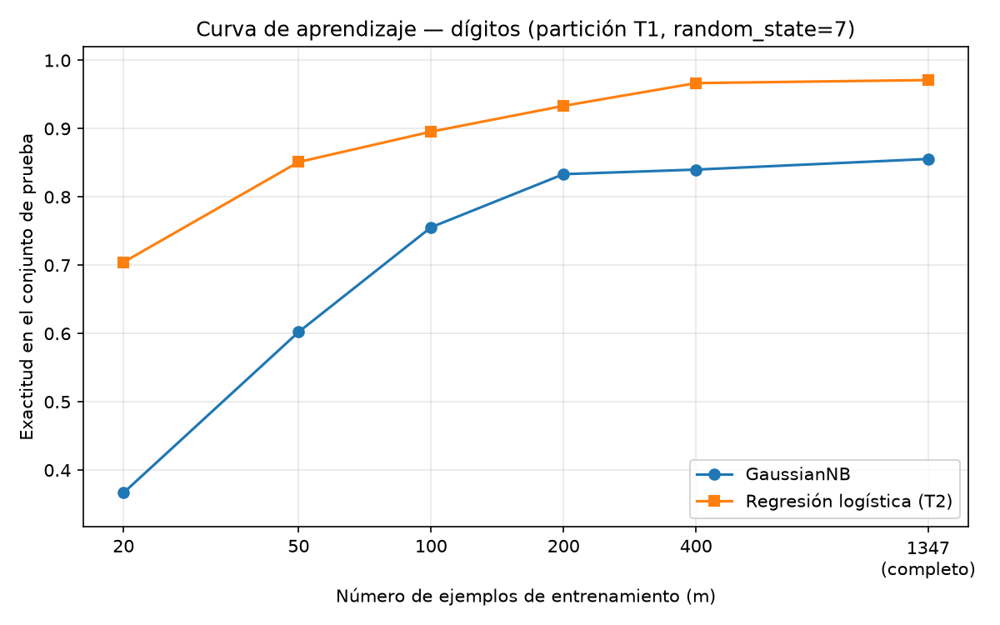

# ¿Gana el generativo con pocos datos? Ng y Jordan sobre dígitos

## Introducción

Ng y Jordan (2001) sostienen que un clasificador generativo como Naive Bayes se acerca a su error asintótico con menos ejemplos que su par discriminativo, la regresión logística, aunque ese error asintótico sea mayor. Este reporte pone a prueba esa afirmación sobre el conjunto de dígitos manuscritos de scikit-learn: se compara un Naive Bayes gaussiano (GNB) con una regresión logística (LR) bajo una única partición entrenamiento/prueba, se miden exactitud y F1 macro, y se traza la curva de aprendizaje de ambos modelos. La pregunta es si aparece el cruce de curvas que predice la teoría y, si no aparece, qué supuesto del modelo generativo falla en estos datos de imágenes.

## Metodología

### Datos y partición

Se cargó `load_digits` y se dividió el conjunto en 75 % entrenamiento y 25 % prueba, estratificando por clase, con `random_state=7`. Esta partición es la única de toda la tarea: el conjunto de prueba no se usó para ajustar ni para elegir nada.

### Los dos clasificadores

Se entrenó un `GaussianNB` con valores por defecto sobre los atributos originales, sin escalar, y una regresión logística sobre atributos estandarizados, dentro de un pipeline cuyo `StandardScaler` se ajusta solo con el conjunto de entrenamiento (definición adoptada: `LogisticRegression(max_iter=1000)`). Se reportan exactitud y F1 macro sobre el conjunto de prueba.

### Curva de aprendizaje

Con la misma partición, se reentrenaron ambos modelos con m = 20, 50, 100, 200 y 400 ejemplos, y con el entrenamiento completo. Cada submuestra se obtuvo con `train_test_split(X_train, y_train, train_size=m, stratify=y_train, random_state=7)`. La evaluación se hizo siempre sobre el mismo conjunto de prueba. Los valores con el entrenamiento completo reproducen exactamente los de la Parte 2, lo que verifica la consistencia de la ejecución. La exactitud se graficó contra m y la figura se guardó como `curva_aprendizaje.png`.

## Resultados

El conjunto tiene 1797 ejemplos, 64 atributos y 10 clases. La partición produjo 1347 ejemplos de entrenamiento y 450 de prueba (proporción de prueba 0.2504). Las clases están equilibradas: en entrenamiento el conteo va de 131 (clase 8) a 137 (clase 3); en prueba, de 43 (clase 8) a 46 (clases 1, 3 y 5).

La tabla siguiente corresponde a la Parte 2 (conjunto de prueba):

| Modelo | Accuracy | F1 macro |
|---|---|---|
| GaussianNB (sin escalar) | 0.8556 | 0.8552 |
| LogisticRegression (estandarizado) | 0.9711 | 0.9711 |

La curva de aprendizaje (figura 1) arrojó estas exactitudes, siempre sobre el mismo conjunto de prueba:

| m (ejemplos) | Exactitud GNB | Exactitud LR |
|---|---|---|
| 20 | 0.3667 | 0.7044 |
| 50 | 0.6022 | 0.8511 |
| 100 | 0.7556 | 0.8956 |
| 200 | 0.8333 | 0.9333 |
| 400 | 0.8400 | 0.9667 |
| 1347 (completo) | 0.8556 | 0.9711 |

## Discusión

Con estas cifras no se observa el cruce que predicen Ng y Jordan: la regresión logística supera al Naive Bayes gaussiano en todos los tamaños probados, desde m=20 (0.7044 contra 0.3667) hasta el entrenamiento completo (0.9711 contra 0.8556). La brecha sí se estrecha de forma marcada respecto al extremo de pocos datos — con m=200 la exactitud es 0.9333 contra 0.8333 —, pero se estabiliza en los tamaños grandes y nunca se cierra ni se invierte. Sí hay una señal compatible con la convergencia más rápida del generativo: en los primeros tramos GNB mejora mucho al añadir datos (pasa de 0.3667 con m=20 a 0.6022 con m=50 y a 0.7556 con m=100), mientras que LR, ya alta, mejora más despacio (de 0.7044 a 0.8511 y a 0.8956 en los mismos tramos). El generativo aprende más rápido por ejemplo, pero parte tan abajo que nunca alcanza al discriminativo.

El supuesto del modelo generativo que puede fallar en estos datos es la independencia condicional entre atributos dada la clase. En imágenes de dígitos los píxeles vecinos están fuertemente correlacionados: el trazo es continuo, de modo que el valor de un píxel predice en gran medida el de sus vecinos. `GaussianNB` modela cada píxel como una gaussiana independiente por clase y descarta esa estructura, por lo que su error asintótico queda muy por encima del de la regresión logística; ningún tamaño de entrenamiento corrige un supuesto estructural equivocado. A esto se suma que con m=20 hay solo 20 ejemplos para 10 clases, insuficientes para estimar de forma estable la media y la varianza de los 64 atributos de cada clase, lo que explica el 0.3667 inicial.

Sobre desde qué tamaño conviene cada modelo: en esta tarea la regresión logística conviene desde el tamaño más pequeño probado (m=20). El Naive Bayes gaussiano no resulta preferible en exactitud en ningún punto de la curva; su mejora temprana más pronunciada solo sugiere que, en un problema donde la independencia condicional se cumpliera mejor, el cruce predicho podría llegar a observarse.

## Conclusiones

Sobre 1797 dígitos con 64 atributos y 10 clases, y una única partición estratificada de 1347 ejemplos de entrenamiento y 450 de prueba, la regresión logística estandarizada alcanzó una exactitud de 0.9711 y un F1 macro de 0.9711, frente a 0.8556 y 0.8552 del Naive Bayes gaussiano. La curva de aprendizaje mantuvo a la regresión logística por delante en todos los tamaños, de 0.7044 contra 0.3667 con m=20 hasta 0.9711 contra 0.8556 con el entrenamiento completo, de modo que no se observó el cruce predicho por Ng y Jordan. La explicación más plausible es el incumplimiento de la independencia condicional entre píxeles vecinos, que degrada el techo del modelo generativo. La recomendación práctica es usar regresión logística para cualquier tamaño de entrenamiento disponible; el generativo solo mostró una mejora por ejemplo más rápida, no una ventaja en exactitud.